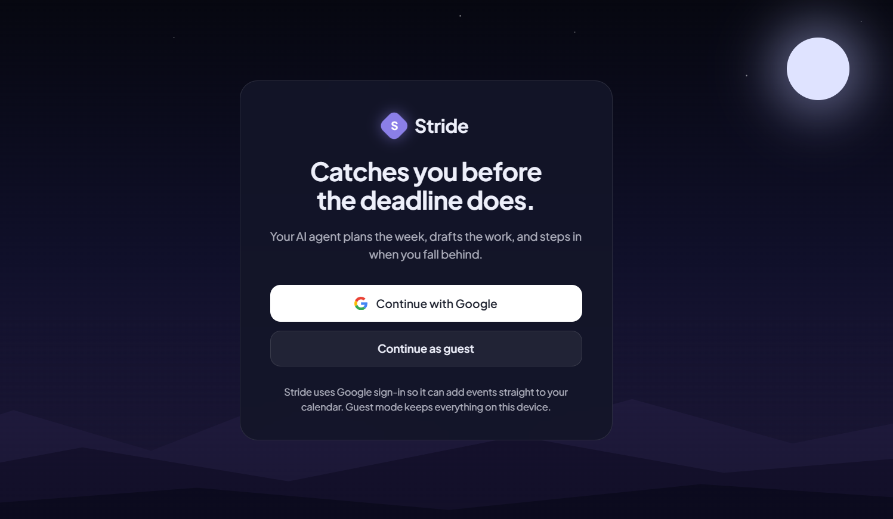
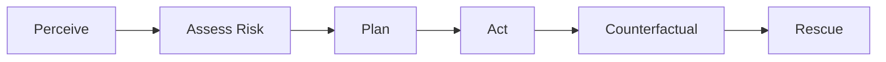

<div align="center">

# Stride

### Catches you before the deadline does.

An AI agent that plans your week, drafts the work, and steps in when you fall behind.

<br/>

[](https://react.dev)
[](https://expressjs.com)
[](https://ai.google.dev)
[](https://firebase.google.com/products/firestore)
[](https://firebase.google.com/products/auth)
[](https://cloud.google.com/run)

<br/>

[](https://stride-1087194712125.asia-south1.run.app)

**[Open the live app](https://stride-1087194712125.asia-south1.run.app)**

</div>

---

## Demo

**Live app:** https://stride-1087194712125.asia-south1.run.app

<div align="center">
  
</div>

---

## The problem

Every productivity tool you have ever used does the same thing: it reminds you. But a reminder is just a notification you can swipe away, and it does nothing to actually move the work forward. So people keep tidy to-do lists and still miss the deadline, because knowing a task exists was never the hard part. Doing it on time is.

## What Stride does differently

Stride acts. It does not remind.

It reads your tasks, scores how at-risk each one is, plans your week around when you actually focus, and drafts the first real piece of the work for you. When something starts to slip, it does not send a louder alert. It runs a rescue: it protects your most important task and drafts a message to buy you time. One agent with a risk brain, not a menu of features.

## The agent loop

Stride runs as a single pipeline. The risk stage is the router that decides whether to flag a task, offer a simulation, or trigger a rescue.



| Stage | What it does |
|-------|--------------|
| **Perceive** | Capture tasks by typing, speaking, or photographing a list, then parse them into structured tasks with deadlines, effort, and dependencies. |
| **Assess Risk** | Score every task from 0 to 100 using urgency, effort against free time, dependency pressure, staleness, and a penalty drawn from your profile, then assign a band. This stage routes everything that follows. |
| **Plan** | Build the week's schedule, placing work in the hours you focus best, and surface the tradeoffs and the tasks at risk. |
| **Act** | The Auto-Action Engine drafts the first real deliverable for a task: an email, a checklist, or a prep doc, written for that specific task. |
| **Counterfactual** | Turn a free-form what-if into concrete changes, recompute the schedule and the risk, then narrate the cascade and recommend. |
| **Rescue** | When a task slips, protect the one that matters most and draft a message to buy time, following the rescue style you chose. |

## Counterfactual simulator

Ask a question in plain words, for example "what if I delay the lab report two days?" Stride turns the question into concrete changes, applies them, recomputes the whole schedule and every risk score, and narrates the cascade across your other deadlines. Then it gives you one clear recommendation. You see the consequence before you commit to it, not after.

## Personalization that actually changes the output

This is the part most apps fake. Stride does not.

Onboarding asks six questions, and each answer is a behavioral dial, not a label on a fixed template:

| Question | Dials |
|----------|-------|
| Who are you planning for | 4 |
| When you focus best | 5 |
| How you handle deadlines | 4 |
| What slows you down (multi-select) | 32 |
| What slips most | 5 |
| How Stride should step in | 4 |

That is **4 x 5 x 4 x 2⁵ x 5 x 4 = 51,200 distinct profiles**. The answers are not cosmetic. They feed four different parts of the engine: when work gets scheduled, how risk is scored, the tone of every drafted message, and how a rescue is run. Give the same three deadlines to a last-minute student and to an early-finishing founder and you get a different plan and a different drafted message. The personalization is in the behavior, not the wording.

## Gamification that keeps you moving

Staying ahead of deadlines is a habit, and habits need a reason to repeat. Stride turns your progress into a climb up a trail of twenty tiers, so consistency becomes something you can watch build instead of a feeling you hope to keep.

**How you earn points.** Momentum Points come from your real task history, never from busywork:

- Finish a task before its deadline and you earn points, with a larger bonus the earlier you finish. More than two days ahead is worth double.
- Heavier tasks are worth more than quick ones.
- Let a task slide past its deadline and you lose points.

Because the score is computed from actual completions, it rewards the one thing that matters: getting the work done on time, and ideally early. Mark a task complete and the points land on your trail.

**The trail.** Twenty named tiers grouped into four arcs. The tier you stand on is simply the highest one your points have reached, so every early finish moves you up.

| Arc | Tiers |
|-----|-------|
| Awakening | Wanderer, Seeker, Pilgrim, Climber, Strider |
| Discipline | Keeper, Forger, Sentinel, Warden, Vanguard |
| Mastery | Ascendant, Aegis, Luminary, Arbiter, Sovereign |
| Transcendence | Paragon, Zenith, Oracle, Eternal, Astral |

Each tier also names a consistency goal, like a multi-day streak, as the longer vision. Points are the only thing that unlock a tier, so the progress you see is always earned.

## Features

Everything here is built and working:

- **Multimodal capture.** Type a brain dump, speak it with your voice, or snap a photo of a written list and read it with on-device OCR.
- **AI task breakdown.** Big tasks are broken into concrete first steps.
- **Transparent risk scoring.** Every task gets a score and a band, low to critical, computed in code from real signals, never a fake probability. A calm Ghost Mode flag marks tasks going quietly stale.
- **Week calendar.** A current-week grid that grows to as many weeks as your tasks need, with today highlighted and at-risk tasks shown in amber.
- **Google Calendar writing.** Add one task as an event or sync the week, written straight to your own Google Calendar.
- **A 20-tier progression trail.** Momentum Points are earned from real task completions before their deadlines, with a time bonus for finishing early, and they move you through twenty named tiers.
- **Day, evening, and night themes** that follow the clock, plus a switcher.
- **Guest mode and Google sign-in.**
- **Persistent storage**, so your tasks, profile, and progress survive a restart.

## Built with

Stride runs deep on Google's stack.

| Layer | Technology |
|-------|-----------|
| Frontend | React + Vite |
| Backend | Node + Express |
| AI | Google Gemini, via the official `@google/genai` SDK |
| Storage | Cloud Firestore |
| Auth | Firebase Authentication (Google sign-in) |
| Calendar | Google Calendar API |
| Hosting | Google Cloud Run (one service) |

Five Google technologies carry the product: Gemini for the generation, Firestore for state, Firebase Auth for identity, the Calendar API for the writes, and Cloud Run for hosting.

## How it works

<details open>
<summary><b>Architecture</b></summary>

<br/>

- **One service.** A single Cloud Run service serves the React client as static files and the Express API from the same origin. No second service to wire up.
- **The key stays on the server.** Only the backend holds the Gemini key and talks to Gemini and Firestore. The frontend never touches the key.
- **Generation runs as background jobs.** Every generative request (parsing, drafting, simulation, risk narration) is started as a Firestore-backed job. The frontend gets a job id and polls for the result, so a long AI request finishes on the server even if the tab is switched or the instance restarts. When you come back, the result is waiting.
- **State lives in Firestore.** Tasks, profile, and signals are persisted through one small storage module, so the data is durable across instances and restarts.

</details>

## Running locally

You need Node, a Google Gemini API key, and a Firebase project for the web config. Firestore reads use Google Application Default Credentials.

```bash
# 1. Server
cd server
npm install
# create ../.env with your key:
#   GEMINI_API_KEY=your_key_here
npm run dev            # starts the API on http://localhost:8787

# 2. Client (in a second terminal)
cd client
npm install
# copy client/.env.example to client/.env and fill in the Firebase web config
npm run dev            # starts the app and proxies /api to the server
```

Open the URL the client prints. The client proxies `/api` to the server, so the frontend never needs the backend address.

---

<div align="center">

**Most apps remind you. Stride moves first.**

<br/>

#Vibe2Ship #CodingNinjas #GoogleForDevelopers

</div>
